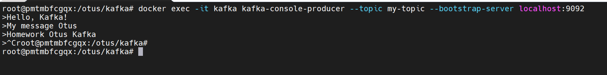
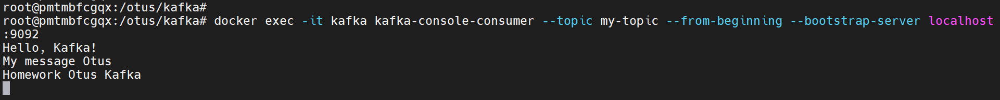
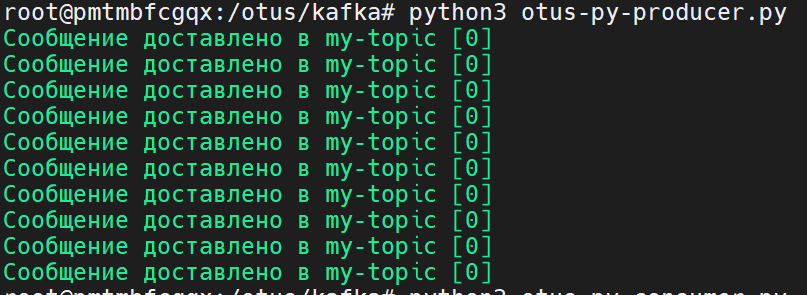
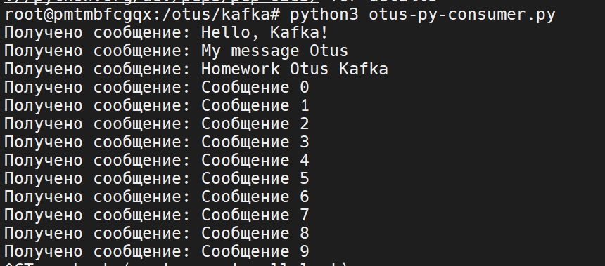

# ДЗ 12. Kafka
## Домашнее задание
Kafka

**Цель**:
научится запускать Kafka, работать с ее утилитами;

**Описание/Пошаговая инструкция выполнения домашнего задания:**

1. Запустите Kafka (можно в docker)
2. Отправьте несколько сообщений используя утилиту kafka-producer
3. Прочитайте их, используя графический интерфейс или утилиту kafka-consumer
4. Отправьте и прочитайте сообщения программно - выберите знакомый язык программирования (C#, Java, Python или любой другой, для которого есть библиотека для работы с Kafka), отправьте и прочитайте несколько сообщений

Для пунктов 2 и 3 сделайте скриншоты отправки и получения сообщений.  
Для пункта 4 приложите ссылку на репозитарий на гитхабе с исходным кодом.

----

## **1. Запуск Kafka в Docker**

Для быстрого запуска Kafka используем `docker-compose`:
```yaml
services:
  zookeeper:
    image: confluentinc/cp-zookeeper:7.0.9
    container_name: zookeeper
    healthcheck:
      test: "[[ $$(echo srvr | nc localhost 2181 | grep -oG 'Mode: standalone') = \"Mode: standalone\" ]]"
      interval: 10s
      timeout: 1s
      retries: 30
    environment:
      ZOOKEEPER_CLIENT_PORT: 2181
      ZOOKEEPER_TICK_TIME: 2000
    ports:
      - "2181:2181"

  kafka:
    image: confluentinc/cp-kafka:7.0.9
    container_name: kafka
    depends_on:
      zookeeper:
        condition: service_healthy
    healthcheck:
      test: "test $$( /usr/bin/zookeeper-shell zookeeper:2181 get /brokers/ids/1 | grep { ) != ''"
      interval: 3s
      timeout: 2s
      retries: 300
    environment:
      KAFKA_BROKER_ID: 1
      KAFKA_ZOOKEEPER_CONNECT: 'zookeeper:2181'
      KAFKA_LISTENER_SECURITY_PROTOCOL_MAP: PLAINTEXT:PLAINTEXT,PLAINTEXT_HOST:PLAINTEXT
      KAFKA_ADVERTISED_LISTENERS: PLAINTEXT://kafka:9092,PLAINTEXT_HOST://localhost:9091
      KAFKA_OFFSETS_TOPIC_REPLICATION_FACTOR: 1
      KAFKA_TRANSACTION_STATE_LOG_MIN_ISR: 1
      KAFKA_TRANSACTION_STATE_LOG_REPLICATION_FACTOR: 1
      KAFKA_GROUP_INITIAL_REBALANCE_DELAY_MS: 0
      KAFKA_JMX_PORT: 9101
      KAFKA_JMX_HOSTNAME: localhost
    volumes:
      - ./connect:/usr/bin/connect
    ports:
      - "9092:9092"
      - "9091:9091"
      - "9101:9101"
```

Запускаем:
```bash
docker-compose up -d
```

## **2. Работа с утилитами Kafka**

**2.1. Создаем топик**
```bash
docker exec -it kafka kafka-topics --create --topic my-topic --partitions 1 --replication-factor 1 --bootstrap-server localhost:9092

Created topic my-topic.
```

**2.2. Отправляем сообщения через `kafka-console-producer`**
Вводим сообщения (по одному в строке) и завершаем ввод с помощью `Ctrl+C`
```bash
docker exec -it kafka kafka-console-producer --topic my-topic --bootstrap-server localhost:9092
>Hello, Kafka!
>My message Otus
>Homework Otus Kafka

```



**2.3. Читаем сообщения через `kafka-console-consumer`**
```bash
docker exec -it kafka kafka-console-consumer --topic my-topic --from-beginning --bootstrap-server localhost:9092
```


Вывод:
```bash
Hello, Kafka!
My message Otus
Homework Otus Kafka
```

## **3. Программная работа с Kafka (Python)**

**3.1. Установка библиотеки `confluent-kafka`**
```bash
pip install confluent-kafka
```

**3.2. Отправка сообщений ( [Producer](12_kafka_files/otus-py-producer.py) )**
```python
from confluent_kafka import Producer

conf = {
    'bootstrap.servers': 'localhost:9091'
}

producer = Producer(conf)

def delivery_report(err, msg):
    if err is not None:
        print(f'Ошибка доставки сообщения: {err}')
    else:
        print(f'Сообщение доставлено в {msg.topic()} [{msg.partition()}]')

topic = 'my-topic'

for i in range(10):
    producer.produce(topic, key=str(i), value=f'Сообщение {i}', callback=delivery_report)
    producer.poll(0)

producer.flush()
```

Запускаем:
```bash
python3 otus-py-producer.py
Сообщение доставлено в my-topic [0]
Сообщение доставлено в my-topic [0]
Сообщение доставлено в my-topic [0]
Сообщение доставлено в my-topic [0]
Сообщение доставлено в my-topic [0]
Сообщение доставлено в my-topic [0]
Сообщение доставлено в my-topic [0]
Сообщение доставлено в my-topic [0]
Сообщение доставлено в my-topic [0]
Сообщение доставлено в my-topic [0]

```



Сообщения успешно записаны в топик `my-topic`

**3.3. Чтение сообщений ( [Consumer](12_kafka_files/otus-py-consumer.py) )**

```python
from confluent_kafka import Consumer, KafkaException

conf = {
    'bootstrap.servers': 'localhost:9091',
    'group.id': 'my_group',
    'auto.offset.reset': 'earliest'
}

consumer = Consumer(conf)

topic = 'my-topic'
consumer.subscribe([topic])

try:
    while True:
        msg = consumer.poll(timeout=1.0)
        if msg is None:
            continue
        if msg.error():
            if msg.error().code() == KafkaError._PARTITION_EOF:
                print(f'Конец раздела {msg.topic()} [{msg.partition()}]')
            elif msg.error():
                raise KafkaException(msg.error())
        else:
            print(f'Получено сообщение: {msg.value().decode("utf-8")}')
finally:
    consumer.close()
```

Запускаем `consumer`:
```bash
python3 otus-py-consumer.py
Получено сообщение: Hello, Kafka!
Получено сообщение: My message Otus
Получено сообщение: Homework Otus Kafka
Получено сообщение: Сообщение 0
Получено сообщение: Сообщение 1
Получено сообщение: Сообщение 2
Получено сообщение: Сообщение 3
Получено сообщение: Сообщение 4
Получено сообщение: Сообщение 5
Получено сообщение: Сообщение 6
Получено сообщение: Сообщение 7
Получено сообщение: Сообщение 8
Получено сообщение: Сообщение 9
```

Все сообщения успешно прочитаны:

