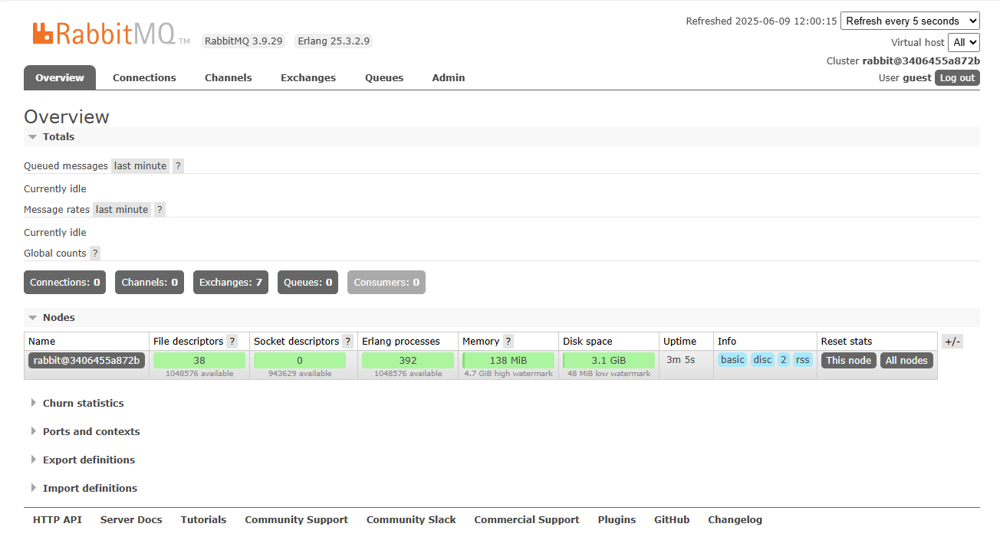
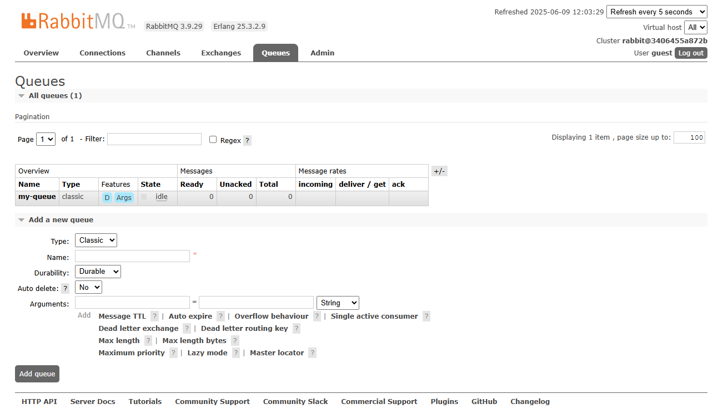
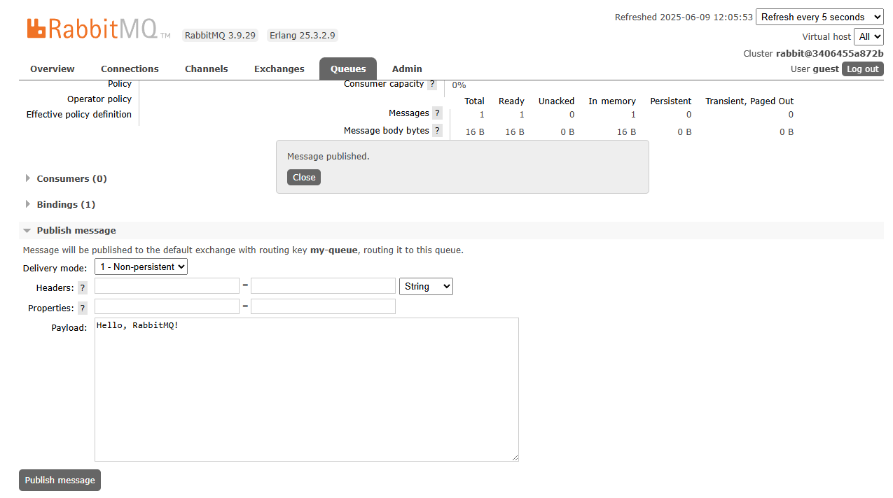
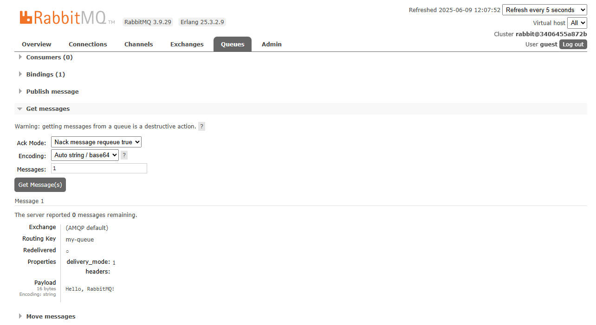

# ДЗ 13. RabbitMQ
## Домашнее задание

Работаем с RabbitMQ

Цель:
научиться запускать RabbitMQ, работать через UI в браузере и с использованием программного кода

Описание/Пошаговая инструкция выполнения домашнего задания:
1. Запустите RabbitMQ (можно в docker)
2. Отправьте несколько тем для сообщений через web UI
3. Прочитайте их, используя web UI в браузере
4. Отправьте и прочитайте сообщения программно - выберите знакомый язык программирования (C#, Java, Go, Python или любой другой, для которого есть библиотека для работы с RabbitMQ), отправьте и прочитайте несколько сообщений

Для пунктов 2 и 3 сделайте скриншоты отправки и получения сообщений.  
Для пункта 4 приложите ссылку на репозитарий на гитхабе с исходным кодом.

---
## **1. Запуск RabbitMQ в Docker**

Сначала запустим RabbitMQ в Docker с включённым веб-интерфейсом (Management plugin).

**Команда для запуска:**

```bash
docker run -it --rm --name rabbitmq -p 5672:5672 -p 15672:15672 rabbitmq:3.9-management
```

- `-p 5672:5672` – порт для AMQP (протокол RabbitMQ)
- `-p 15672:15672` – порт веб-интерфейса
- `rabbitmq:3.9-management` – образ с включённым UI
    
**Проверка работы:**

Открыть в браузере:  
- [http://localhost:15672](http://localhost:15672/)
- Логин: `guest`
- Пароль: `guest`



## **2. Работа с веб-интерфейсом RabbitMQ**

**Шаг 1: Создание очереди**

- Перейдём во вкладку **Queues**
- Нажимаем **Add a new queue**
- Введим имя очереди `my-queue`
- Оставляем настройки по умолчанию и жмём **Add queue**



 **Шаг 2: Отправка сообщения**
- Перейдём во вкладку **Queues** → выберем `my-queue`
- В разделе **Publish message** введим:
    - **Payload** (тело сообщения): `Hello, RabbitMQ!`
- Нажимаем **Publish message**



 **Шаг 3: Чтение сообщения**
- В той же очереди (`my-queue`) жмём **Get Messages**
- Выбираем **Ack mode: `Nack message requeue false`** (чтобы сообщение удалилось после чтения)
- Жмём **Get Message(s)** – и видим отправленное сообщение



## **3. Работа с RabbitMQ через Python**

**Установка библиотеки `pika`**
```bash
pip install pika
```

**Код для отправки сообщения ( [Producer](13_rabbitmq_files/otus-rmq-producer.png) )**
```python
import pika

# Подключение к RabbitMQ
connection = pika.BlockingConnection(pika.ConnectionParameters('localhost'))
channel = connection.channel()

# Создание очереди (если её нет)
channel.queue_declare(queue='python_queue')

# Отправка сообщения
channel.basic_publish(
    exchange='',
    routing_key='python_queue',
    body='Hello from Python!'
)
print(" [x] Sent 'Hello from Python!'")

# Закрытие соединения
connection.close()
```

**Запускаем:**
```bash
python3 otus-rmq-producer.py
 [x] Sent 'Hello from Python!'
```


**Код для чтения сообщений ( [Consumer](13_rabbitmq_files/otus-rmq-consumer.png) )**
```python
import pika

# Подключение к RabbitMQ
connection = pika.BlockingConnection(pika.ConnectionParameters('localhost'))
channel = connection.channel()

# Создание очереди (если её нет)
channel.queue_declare(queue='python_queue')

# Функция для обработки сообщений
def callback(ch, method, properties, body):
    print(f" [x] Received {body}")

# Подписка на очередь
channel.basic_consume(
    queue='python_queue',
    auto_ack=True,  # автоматическое подтверждение получения
    on_message_callback=callback
)

print(' [*] Waiting for messages. To exit press CTRL+C')
channel.start_consuming()
```

**Запускаем:**
```bash
python3 otus-rmq-consumer.py
 [*] Waiting for messages. To exit press CTRL+C
 [x] Received b'Hello from Python!'

```

