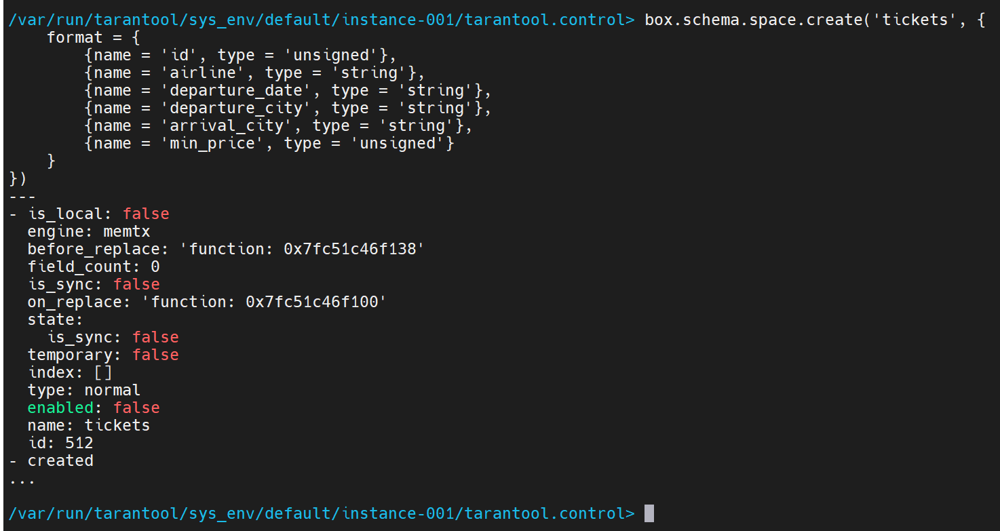
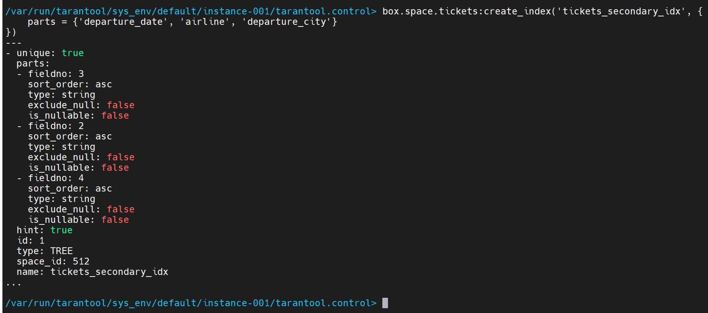
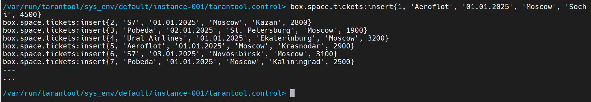
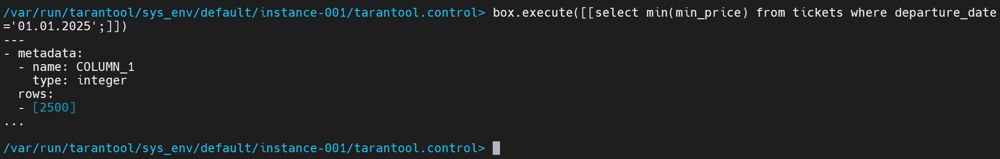
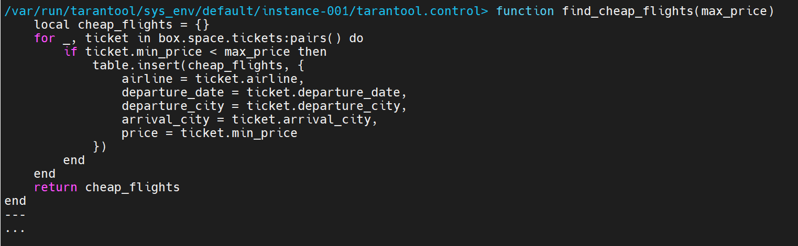
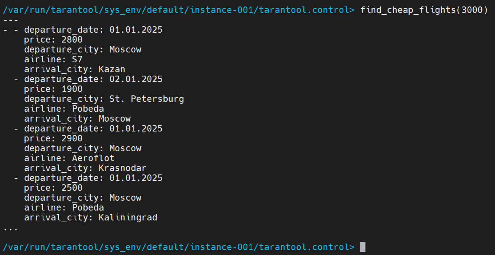

# ДЗ 15. Работа с tarantool
## Домашнее задание
Работа с tarantool

Цель:
настроить базовое взаимодействие с Tarantool для хранения и выборки данных, используя индексы и встроенные функции.

Описание/Пошаговая инструкция выполнения домашнего задания:
1. Установите Tarantool одним из доступных способов: через виртуальную машину (ВМ) или Docker.
2. Создайте в Box спейс (таблицу) для хранения данных о поисках авиабилетов с полями:

- id (уникальный идентификатор),
- airline (авиакомпания),
- departure_date (дата вылета),
- departure_city (город вылета),
- arrival_city (город прилета),
- min_price (минимальная стоимость авиабилета).

3. Добавьте первичный индекс для спейса.
4. Создайте вторичный индекс на поля departure_date, airline и departure_city.
5. Вставьте несколько записей в спейс.
6. Напишите запрос для выборки минимальной стоимости авиабилета на рейсы с датой вылета 01.01.2025.
7. Реализуйте функцию на Lua для вывода списка рейсов с минимальной стоимостью билета менее 3000 рублей.  
          
    На проверку отправьте текстовый документ, содержащий:  
    текст выполняемых запросов и настроек для каждого этапа задания;  
    код функции на Lua;  
    скриншоты вывода запросов и результата работы функции.

  
Критерии оценки:
Задание считается выполненным, если Tarantool установлен, спейс и индексы созданы, данные вставлены, запросы и Lua-функция выполнены, а команды и результаты предоставлены.

-----

## 1. Установка Tarantool

Запустим Tarantool с помощью Docker, выполнив команду:
```bash
docker run -d --name mytarantool -p 3301:3301 tarantool/tarantool
```

После старта пробуем запустить консоль:
```bash
docker exec -it mytarantool console
```

Видим успешное подключение и приглашение консоли на ввод команд:
```log
   • Connecting to the instance...
   • Connected to /var/run/tarantool/sys_env/default/instance-001/tarantool.control

/var/run/tarantool/sys_env/default/instance-001/tarantool.control>
```
## 2. Создание спейса

В консоле Tarantool выполним следующие команды:

1. Создаём спейс `tickets` для данных о билетах:
```lua
box.schema.space.create('tickets', {
    format = {
        {name = 'id', type = 'unsigned'},
        {name = 'airline', type = 'string'},
        {name = 'departure_date', type = 'string'},
        {name = 'departure_city', type = 'string'},
        {name = 'arrival_city', type = 'string'},
        {name = 'min_price', type = 'unsigned'}
    }
})
```

`space` успешно создан:


2. Создание первичного индекса `tickets_primary_idx`:
```lua
 box.space.tickets:create_index('tickets_primary_idx', {
    parts = {'id'}
})
```
Результат:


3. Создание вторичного индекса `tickets_secondary_idx`
```lua
box.space.tickets:create_index('tickets_secondary_idx', {
    parts = {'departure_date', 'airline', 'departure_city'},
    unique = false
})
```
Создаём неункальный индекс, т.к. в одну дату может быть несколько рейсов.

Результат:


## 3. Вставка тестовых данных

Вставляем несколько записей:
```lua
box.space.tickets:insert{1, 'Aeroflot', '01.01.2025', 'Moscow', 'Sochi', 4500}
box.space.tickets:insert{2, 'S7', '01.01.2025', 'Moscow', 'Kazan', 2800}
box.space.tickets:insert{3, 'Pobeda', '02.01.2025', 'St. Petersburg', 'Moscow', 1900}
box.space.tickets:insert{4, 'Ural Airlines', '01.01.2025', 'Ekaterinburg', 'Moscow', 3200}
box.space.tickets:insert{5, 'Aeroflot', '01.01.2025', 'Moscow', 'Krasnodar', 2900}
box.space.tickets:insert{6, 'S7', '03.01.2025', 'Novosibirsk', 'Moscow', 3100}
box.space.tickets:insert{7, 'Pobeda', '01.01.2025', 'Moscow', 'Kaliningrad', 2500}
```



## 4. Запрос для выборки минимальной стоимости на 01.01.2025
Для поиска минимальной стоимости, воспользуемся возможностью выполнения sql-запроса из lua [SQL tutorial](https://www.tarantool.io/en/doc/latest/platform/ddl_dml/sql/sql_tutorial/#box-execute)

```lua
box.execute([[select min(min_price) from tickets where departure_date ='01.01.2025';]])
```
Результат:


## 5. Функция на Lua для вывода списка рейсов с ценой менее 3000 рублей

Создадим функцию `find_cheap_flights` со значением цены в качестве аргумента:
```lua
function find_cheap_flights(max_price)
    local cheap_flights = {}
    for _, ticket in box.space.tickets:pairs() do
        if ticket.min_price < max_price then
            table.insert(cheap_flights, {
                airline = ticket.airline,
                departure_date = ticket.departure_date,
                departure_city = ticket.departure_city,
                arrival_city = ticket.arrival_city,
                price = ticket.min_price
            })
        end
    end
    return cheap_flights
end
```



Запускаем функцию, передаём цену в качестве аргумента:
```lua
find_cheap_flights(3000)
```
Найдено 4 рейса:

