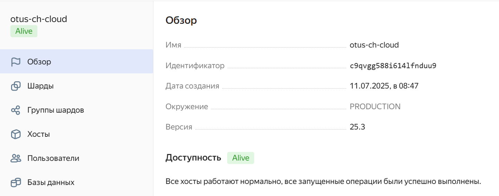
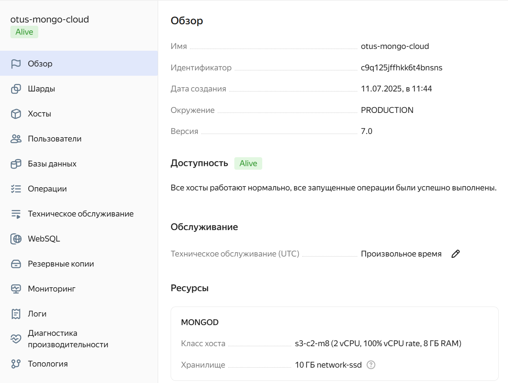

# ДЗ 16. Облака

## Домашнее задание

Облака

Цель:
В результате выполнения ДЗ вы поработает с облаками.

Описание/Пошаговая инструкция выполнения домашнего задания:
Необходимо:
- одну из облачных БД заполнить данными (любыми из предыдущих дз);
- протестировать скорость запросов.
---
Задание повышенной сложности*  
сравнить 2-3 облачных NoSQL по скорости загрузки данных и времени выполнения запросов.

---
## Создание ресурсов в Yandex Cloud

Разворачиваем ClickHouse в Яндекс Облаке с именем `otus-ch-cloud` в минимальном конфиге и дожидаемся завершения создания кластера.



Взаимодействовать с БД будем при помощи `clickhouse-client`, для этого сконфигурируем соединение, как указано в документации и подключимся:
```bash
clickhouse-client --host rc1d-gl6jv72d8itoqhgr.mdb.yandexcloud.net \
                  --secure \
                  --user admin \
                  --database otus_cloud \
                  --port 9440 \
                  --ask-password
```

В качестве теста грузим открытый датасет по поездкам на такси.
Создаём таблицу `trips`:
```sql
CREATE TABLE trips
(
    `trip_id` UInt32,
    `vendor_id` Enum8('1' = 1, '2' = 2, '3' = 3, '4' = 4, 'CMT' = 5, 'VTS' = 6, 'DDS' = 7, 'B02512' = 10, 'B02598' = 11, 'B02617' = 12, 'B02682' = 13, 'B02764' = 14, '' = 15),
    `pickup_date` Date,
    `pickup_datetime` DateTime,
    `dropoff_date` Date,
    `dropoff_datetime` DateTime,
    `store_and_fwd_flag` UInt8,
    `rate_code_id` UInt8,
    `pickup_longitude` Float64,
    `pickup_latitude` Float64,
    `dropoff_longitude` Float64,
    `dropoff_latitude` Float64,
    `passenger_count` UInt8,
    `trip_distance` Float64,
    `fare_amount` Float32,
    `extra` Float32,
    `mta_tax` Float32,
    `tip_amount` Float32,
    `tolls_amount` Float32,
    `ehail_fee` Float32,
    `improvement_surcharge` Float32,
    `total_amount` Float32,
    `payment_type` Enum8('UNK' = 0, 'CSH' = 1, 'CRE' = 2, 'NOC' = 3, 'DIS' = 4),
    `trip_type` UInt8,
    `pickup` FixedString(25),
    `dropoff` FixedString(25),
    `cab_type` Enum8('yellow' = 1, 'green' = 2, 'uber' = 3),
    `pickup_nyct2010_gid` Int8,
    `pickup_ctlabel` Float32,
    `pickup_borocode` Int8,
    `pickup_ct2010` String,
    `pickup_boroct2010` String,
    `pickup_cdeligibil` String,
    `pickup_ntacode` FixedString(4),
    `pickup_ntaname` String,
    `pickup_puma` UInt16,
    `dropoff_nyct2010_gid` UInt8,
    `dropoff_ctlabel` Float32,
    `dropoff_borocode` UInt8,
    `dropoff_ct2010` String,
    `dropoff_boroct2010` String,
    `dropoff_cdeligibil` String,
    `dropoff_ntacode` FixedString(4),
    `dropoff_ntaname` String,
    `dropoff_puma` UInt16
)
ENGINE = MergeTree
PARTITION BY toYYYYMM(pickup_date)
ORDER BY pickup_datetime;
```

**Заливаем данные:**
```sql
INSERT INTO trips
SELECT * FROM s3(
    'https://datasets-documentation.s3.eu-west-3.amazonaws.com/nyc-taxi/trips_{1..2}.gz',
    'TabSeparatedWithNames', "
    `trip_id` UInt32,
    `vendor_id` Enum8('1' = 1, '2' = 2, '3' = 3, '4' = 4, 'CMT' = 5, 'VTS' = 6, 'DDS' = 7, 'B02512' = 10, 'B02598' = 11, 'B02617' = 12, 'B02682' = 13, 'B02764' = 14, '' = 15),
    `pickup_date` Date,
    `pickup_datetime` DateTime,
    `dropoff_date` Date,
    `dropoff_datetime` DateTime,
    `store_and_fwd_flag` UInt8,
    `rate_code_id` UInt8,
    `pickup_longitude` Float64,
    `pickup_latitude` Float64,
    `dropoff_longitude` Float64,
    `dropoff_latitude` Float64,
    `passenger_count` UInt8,
    `trip_distance` Float64,
    `fare_amount` Float32,
    `extra` Float32,
    `mta_tax` Float32,
    `tip_amount` Float32,
    `tolls_amount` Float32,
    `ehail_fee` Float32,
    `improvement_surcharge` Float32,
    `total_amount` Float32,
    `payment_type` Enum8('UNK' = 0, 'CSH' = 1, 'CRE' = 2, 'NOC' = 3, 'DIS' = 4),
    `trip_type` UInt8,
    `pickup` FixedString(25),
    `dropoff` FixedString(25),
    `cab_type` Enum8('yellow' = 1, 'green' = 2, 'uber' = 3),
    `pickup_nyct2010_gid` Int8,
    `pickup_ctlabel` Float32,
    `pickup_borocode` Int8,
    `pickup_ct2010` String,
    `pickup_boroct2010` String,
    `pickup_cdeligibil` String,
    `pickup_ntacode` FixedString(4),
    `pickup_ntaname` String,
    `pickup_puma` UInt16,
    `dropoff_nyct2010_gid` UInt8,
    `dropoff_ctlabel` Float32,
    `dropoff_borocode` UInt8,
    `dropoff_ct2010` String,
    `dropoff_boroct2010` String,
    `dropoff_cdeligibil` String,
    `dropoff_ntacode` FixedString(4),
    `dropoff_ntaname` String,
    `dropoff_puma` UInt16
") SETTINGS input_format_try_infer_datetimes = 0
```

Результат:
```bash
Query id: ee89dbaf-15ae-4f73-a85a-82757cbf910a

Ok.

0 rows in set. Elapsed: 10.139 sec. Processed 2.00 million rows, 163.07 MB (197.22 thousand rows/s., 16.08 MB/s.)
Peak memory usage: 977.87 MiB.
```

Проверяем:
```bash
rc1d-gl6jv72d8itoqhgr.mdb.yandexcloud.net :) select count() from trips;

SELECT count()
FROM trips

Query id: 40cd8163-91e1-4e3b-af82-2d0f23c299f4

   ┌─count()─┐
1. │ 1999657 │ -- 2.00 million
   └─────────┘

1 row in set. Elapsed: 0.003 sec.

rc1d-gl6jv72d8itoqhgr.mdb.yandexcloud.net :)
```

**Выполним несколько запросов на выборку.**
**Считаем среднюю стоимость в зависимости от количества пассажиров:**
```sql
rc1d-gl6jv72d8itoqhgr.mdb.yandexcloud.net :) SELECT
    passenger_count,
    ceil(avg(total_amount), 2) AS average_total_amount
FROM trips
GROUP BY passenger_count;

Query id: 7749384c-cc47-4b7a-8e73-1dbc560d35e5

    ┌─passenger_count─┬─average_total_amount─┐
 1. │               0 │                22.69 │
 2. │               1 │                15.97 │
 3. │               2 │                17.15 │
 4. │               3 │                16.76 │
 5. │               4 │                17.33 │
 6. │               5 │                16.35 │
 7. │               6 │                16.04 │
 8. │               7 │                 59.8 │
 9. │               8 │                36.41 │
10. │               9 │                 9.81 │
    └─────────────────┴──────────────────────┘

10 rows in set. Elapsed: 0.037 sec. Processed 2.00 million rows, 10.00 MB (54.26 million rows/s., 271.30 MB/s.)
Peak memory usage: 558.69 KiB.

rc1d-gl6jv72d8itoqhgr.mdb.yandexcloud.net :)
```

**Считаем ежедневное количество подвозов в каждом районе:**
```sql
rc1d-gl6jv72d8itoqhgr.mdb.yandexcloud.net :) SELECT
    pickup_date,
    pickup_ntaname,
    SUM(1) AS number_of_trips
FROM trips
GROUP BY
    pickup_date,
    pickup_ntaname
ORDER BY pickup_date ASC;

Query id: 10b3a42a-0320-4bfb-bbf9-b24ef40e314a

      ┌─pickup_date─┬─pickup_ntaname─────────────────────────────────────┬─number_of_trips─┐
   1. │  2015-07-01 │ Brooklyn Heights-Cobble Hill                       │              13 │
   2. │  2015-07-01 │ Old Astoria                                        │               5 │
   3. │  2015-07-01 │ Flushing                                           │               1 │
   4. │  2015-07-01 │ Yorkville                                          │             378 │
   5. │  2015-07-01 │ Gramercy                                           │             344 │

...................

Showed 1000 out of 8751 rows.

8751 rows in set. Elapsed: 0.124 sec. Processed 2.00 million rows, 64.32 MB (16.08 million rows/s., 517.20 MB/s.)
Peak memory usage: 8.14 MiB.
```

**Считаем количество пикапов в каждом районе в разбивке по часам дня:**
```sql
rc1d-gl6jv72d8itoqhgr.mdb.yandexcloud.net :) SELECT
    pickup_ntaname,
    toHour(pickup_datetime) AS pickup_hour,
    SUM(1) AS pickups
FROM trips
WHERE pickup_ntaname != ''
GROUP BY
    pickup_ntaname,
    pickup_hour
ORDER BY
    pickup_ntaname ASC,
    pickup_hour ASC;

SELECT
    pickup_ntaname,
    toHour(pickup_datetime) AS pickup_hour,
    SUM(1) AS pickups
FROM trips
WHERE pickup_ntaname != ''
GROUP BY
    pickup_ntaname,
    pickup_hour
ORDER BY
    pickup_ntaname ASC,
    pickup_hour ASC

Query id: 4d8719b2-36e4-4527-8bb1-3809d86db868

      ┌─pickup_ntaname───────────────────────────────────────────┬─pickup_hour─┬─pickups─┐
   1. │ Airport                                                  │           0 │    3509 │
   2. │ Airport                                                  │           1 │    1184 │
   3. │ Airport                                                  │           2 │     401 │
   4. │ Airport                                                  │           3 │     152 │
   5. │ Airport                                                  │           4 │     213 │

.........................................

Showed 1000 out of 3120 rows.

3120 rows in set. Elapsed: 0.148 sec. Processed 2.00 million rows, 68.32 MB (13.54 million rows/s., 462.65 MB/s.)
Peak memory usage: 8.81 MiB.
```


## Разворачиваем MongoDB в Yandex Cloud

Создаём MongoDB в сопоставимой конфигурацией по ресурсам:



Настраиваем права пользователя:


Конфигурируем подключение и подключаемся из локальной утилиты `mongosh` к облачной `MongoDB`

```bash
mongosh --norc \
        --tls \
        --tlsCAFile ~/.mongodb/root.crt \
        --host 'rs01/rc1d-c1j855eagv7qgq3d.mdb.yandexcloud.net:27018' \
        --username <user> \
        --password <pass> \
        otus-mongodb
```

Создаем коллекцию `trips`
```bash
db.createCollection("trips");
```
### Подготовка данных и загрузка в MongoDB

Скачиваем файлы на локальную машину:
```bash
curl -O https://datasets-documentation.s3.eu-west-3.amazonaws.com/nyc-taxi/trips_1.gz
curl -O https://datasets-documentation.s3.eu-west-3.amazonaws.com/nyc-taxi/trips_2.gz
```

Конвертируем в JSON
```bash
 zcat trips_1.gz | jq -R -s -c 'split("\n") | map(split("\t")) | .[0] as $header | .[1:] | map([$header, .] | transpose | map({(.[0]): .[1]}) | add)' > trips_1.json
zcat trips_2.gz | jq -R -s -c 'split("\n") | map(split("\t")) | .[0] as $header | .[1:] | map([$header, .] | transpose | map({(.[0]): .[1]}) | add)' > trips_2.json
```

 Используем `mongoimport` для заливки данных:
```bash
mongoimport --ssl --host 'rs01/rc1d-c1j855eagv7qgq3d.mdb.yandexcloud.net:27018' -u otusadm -p ************ --db=otus-mongodb --collection=trips --file=trips_1.json --jsonArray
2025-07-11T09:45:16.917+0000    connected to: mongodb://rc1d-c1j855eagv7qgq3d.mdb.yandexcloud.net:27018/?replicaSet=rs01
2025-07-11T09:45:19.917+0000    [........................] otus-mongodb.trips   20.0MB/1.08GB (1.8%)
2025-07-11T09:45:22.918+0000    [........................] otus-mongodb.trips   42.1MB/1.08GB (3.8%)
2025-07-11T09:45:25.918+0000    [#.......................] otus-mongodb.trips   113MB/1.08GB (10.2%)
............
2025-07-11T09:48:55.918+0000    [#######################.] otus-mongodb.trips   1.05GB/1.08GB (97.5%)
2025-07-11T09:48:58.918+0000    [#######################.] otus-mongodb.trips   1.07GB/1.08GB (99.0%)
2025-07-11T09:49:01.354+0000    [########################] otus-mongodb.trips   1.08GB/1.08GB (100.0%)
2025-07-11T09:49:01.354+0000    999833 document(s) imported successfully. 0 document(s) failed to import.
```

Вторая часть данных:
```bash
root@kbhjkvdgsp:/dataset# mongoimport --ssl --host 'rs01/rc1d-c1j855eagv7qgq3d.mdb.yandexcloud.net:27018' -u otusadm -p *********** --db=otus-mongodb --collection=trips --file=trips_2.json --jsonArray
2025-07-11T09:49:44.601+0000    connected to: mongodb://rc1d-c1j855eagv7qgq3d.mdb.yandexcloud.net:27018/?replicaSet=rs01
2025-07-11T09:49:47.602+0000    [........................] otus-mongodb.trips   19.1MB/1.08GB (1.7%)
2025-07-11T09:49:50.602+0000    [........................] otus-mongodb.trips   39.9MB/1.08GB (3.6%)
2025-07-11T09:49:53.602+0000    [#.......................] otus-mongodb.trips   56.5MB/1.08GB (5.1%)
................
2025-07-11T09:53:23.602+0000    [#######################.] otus-mongodb.trips   1.06GB/1.08GB (97.8%)
2025-07-11T09:53:26.602+0000    [#######################.] otus-mongodb.trips   1.07GB/1.08GB (99.0%)
2025-07-11T09:53:29.142+0000    [########################] otus-mongodb.trips   1.08GB/1.08GB (100.0%)
2025-07-11T09:53:29.142+0000    999826 document(s) imported successfully. 0 document(s) failed to import.
```

Проверяем:
```bash
rs01 [primary] otus-mongodb> db.trips.countDocuments();
1999659
```
Документы успешно загружены.

**Считаем среднюю стоимость в зависимости от количества пассажиров:**
```javascript
db.trips.aggregate([
  {
    $match: {
      passenger_count: { $exists: true, $ne: null },
      total_amount: { $exists: true, $ne: null, $type: ["string", "int", "long", "double", "decimal"] }
    }
  },
  {
    $addFields: {
      total_amount_num: {
        $convert: {
          input: "$total_amount",
          to: "double",
          onError: null,
          onNull: null
        }
      }
    }
  },
  {
    $match: {
      total_amount_num: { $ne: null, $gte: 0 }
    }
  },
  {
    $group: {
      _id: "$passenger_count",
      average_total_amount: { $avg: "$total_amount_num" }
    }
  },
  {
    $project: {
      passenger_count: "$_id",
      average_total_amount: {
        $round: [
          {
            $divide: [
              { $trunc: { $multiply: ["$average_total_amount", 100] } },
              100
            ]
          },
          2
        ]
      },
      _id: 0
    }
  },
  {
    $sort: { passenger_count: 1 }
  }
]).;
```

**Ответ:**
```text
[
  { passenger_count: '0', average_total_amount: 22.92 },
  { passenger_count: '1', average_total_amount: 15.97 },
  { passenger_count: '2', average_total_amount: 17.15 },
  { passenger_count: '3', average_total_amount: 16.76 },
  { passenger_count: '4', average_total_amount: 17.32 },
  { passenger_count: '5', average_total_amount: 16.36 },
  { passenger_count: '6', average_total_amount: 16.03 },
  { passenger_count: '7', average_total_amount: 59.79 },
  { passenger_count: '8', average_total_amount: 36.4 },
  { passenger_count: '9', average_total_amount: 9.79 }
]
```

Проверяем время выполнения запроса через `explain("executionStats")`:
`executionStats.executionTimeMillis: 9123 ms`

**Считаем ежедневное количество подвозов в каждом районе:**
```javascript
db.trips.aggregate([
  {
    $match: {
      pickup_date: { $exists: true, $ne: null },
      pickup_ntaname: { $exists: true, $ne: null }
    }
  },
  {
    $group: {
      _id: {
        date: "$pickup_date",
        neighborhood: "$pickup_ntaname"
      },
      number_of_trips: { $sum: 1 }
    }
  },
  {
    $project: {
      pickup_date: "$_id.date",
      pickup_ntaname: "$_id.neighborhood",
      number_of_trips: 1,
      _id: 0
    }
  },
  {
    $sort: { pickup_date: 1 }
  }
]).explain("executionStats");
```

Пример вывода:
```text
[
  {
    number_of_trips: 1,
    pickup_date: '2015-07-01',
    pickup_ntaname: 'Baisley Park'
  },
  {
    number_of_trips: 2258,
    pickup_date: '2015-07-01',
    pickup_ntaname: 'Midtown-Midtown South'
  },
  {
    number_of_trips: 2,
    pickup_date: '2015-07-01',
    pickup_ntaname: 'Flatbush'
  },
  //..............................
]

```

Проверяем время выполнения запроса через `explain("executionStats")`:
`executionStats.executionTimeMillis: 7240 ms`

**Считаем количество пикапов в каждом районе в разбивке по часам дня:**
```javascript
db.trips.aggregate([
  {
    $match: {
      pickup_ntaname: { $exists: true, $ne: "" },
      pickup_datetime: { $exists: true, $ne: null }
    }
  },
  {
    $addFields: {
      datetime_converted: {
        $dateFromString: {
          dateString: "$pickup_datetime",
          format: "%Y-%m-%d %H:%M:%S"
        }
      }
    }
  },
  {
    $addFields: {
      pickup_hour: { $hour: "$datetime_converted" }
    }
  },
  {
    $group: {
      _id: {
        neighborhood: "$pickup_ntaname",
        hour: "$pickup_hour"
      },
      pickups: { $sum: 1 }
    }
  },
  {
    $project: {
      pickup_ntaname: "$_id.neighborhood",
      pickup_hour: "$_id.hour",
      pickups: 1,
      _id: 0
    }
  },
  {
    $sort: {
      pickup_ntaname: 1,
      pickup_hour: 1
    }
  }
]);
```

Проверяем время выполнения запроса через `explain("executionStats")`:
`executionStats.executionTimeMillis: 10171 ms`

Пример вывода:
```text
[
  { pickups: 3509, pickup_ntaname: 'Airport', pickup_hour: 0 },
  { pickups: 1184, pickup_ntaname: 'Airport', pickup_hour: 1 },
  { pickups: 401, pickup_ntaname: 'Airport', pickup_hour: 2 },
  { pickups: 152, pickup_ntaname: 'Airport', pickup_hour: 3 },
  { pickups: 213, pickup_ntaname: 'Airport', pickup_hour: 4 },
  { pickups: 955, pickup_ntaname: 'Airport', pickup_hour: 5 },
  { pickups: 2161, pickup_ntaname: 'Airport', pickup_hour: 6 },
  { pickups: 3013, pickup_ntaname: 'Airport', pickup_hour: 7 },
  { pickups: 3601, pickup_ntaname: 'Airport', pickup_hour: 8 },
  { pickups: 3792, pickup_ntaname: 'Airport', pickup_hour: 9 },
  { pickups: 4546, pickup_ntaname: 'Airport', pickup_hour: 10 },
  { pickups: 4659, pickup_ntaname: 'Airport', pickup_hour: 11 },
  { pickups: 4621, pickup_ntaname: 'Airport', pickup_hour: 12 },
  { pickups: 5348, pickup_ntaname: 'Airport', pickup_hour: 13 },
  { pickups: 5889, pickup_ntaname: 'Airport', pickup_hour: 14 },
  { pickups: 6505, pickup_ntaname: 'Airport', pickup_hour: 15 },
  { pickups: 6119, pickup_ntaname: 'Airport', pickup_hour: 16 },
  { pickups: 6341, pickup_ntaname: 'Airport', pickup_hour: 17 },
  { pickups: 6173, pickup_ntaname: 'Airport', pickup_hour: 18 },
  { pickups: 6329, pickup_ntaname: 'Airport', pickup_hour: 19 }
]
```

## Выводы
Провели сравнение MongoDB vs ClickHouse в облаке на сопоставимых ресурсах, в целом на **этом кейсе** результаты ожидаемые - CH показал результат по скорости загрузки и получению данных гораздо лучше, чем Mongo. Можно добиться лучших результатов от Mongo, если построить индексы и проработать схему данных, но конкретно в данном кейсе у MongoBD мало шансов превзойти ClickHouse.
