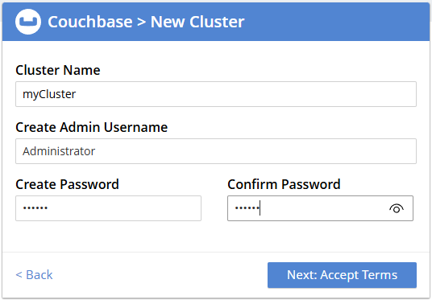
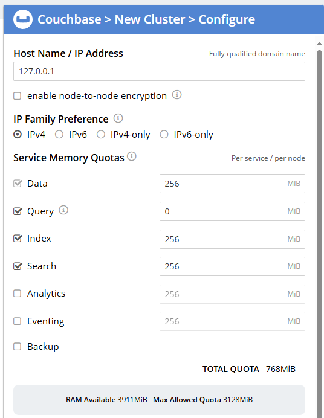
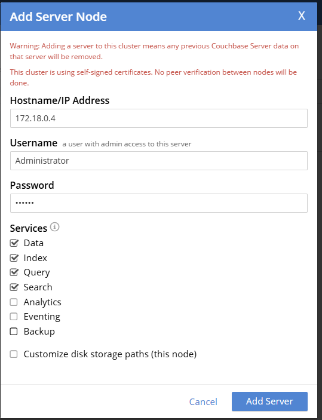
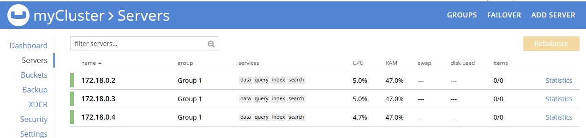
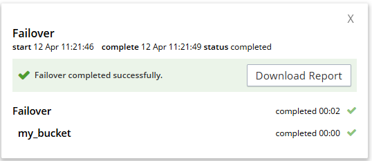

## Домашнее задание 4 Couchbase

Кластер Couchbase

Цель:
В результате выполнения ДЗ вы построение отказоустойчивый кластер Couchbase.

Описание/Пошаговая инструкция выполнения домашнего задания:

Развернуть кластер Couchbase  
Создать БД, наполнить небольшими тестовыми данными  
Проверить отказоустойчивость

Критерии оценки:

- задание выполнено - 10 баллов
- предложено красивое решение - плюс 2 балла

Минимальный порог: 10 баллов

---
### **Отчёт о выполнении**
#### Разворачиваем кластер Couchbase при помощи docker-compose.
Создадим файл `docker-compose.yml` с тремя нодами Couchbase (для отказоустойчивости минимум 3 узла):
```yaml
services:
  couchbase1:
    image: couchbase/server
    container_name: couchbase1
    volumes:
      - .app/node1:/opt/couchbase/var
    ports:
      - 8094:8091
    networks:
      - couchbase-net
      
  couchbase2:
    image: couchbase/server
    container_name: couchbase2
    volumes:
      - .app/node2:/opt/couchbase/var
    ports:
      - 8095:8091
    networks:
      - couchbase-net
      
  couchbase3:
    image: couchbase/server
    container_name: couchbase3
    volumes:
      - .app/node3:/opt/couchbase/var
    ports:
      - 8091:8091
      - 8092:8092
      - 8093:8093
      - 11210:11210
    networks:
      - couchbase-net

networks:
  couchbase-net:
    driver: bridge
```
#### Запуск кластера
```bash
docker-compose up -d
[+] Running 4/4
 ✔ Network couchbase_couchbase-net  Created                                         0.1s
 ✔ Container couchbase3             Started                                         0.7s
 ✔ Container couchbase2             Started                                         0.4s
 ✔ Container couchbase1             Started                                         0.4s
```
#### Настройка кластера

1.Откроем веб-интерфейс Couchbase: `http://localhost:8094`
* Создаём новый кластер `myCluster` через `Setup New Cluster`
  
* Меняем конфигурацию, из-за слабой хост машины выделяем минимальные значения квоты памяти в `256 MiB`, оставляем только роли ноды `Data`, `Query`, `Index` и `Search` - в рамках учебного запуска этого будет достаточно. Остальные параметры по-умолчанию:
  
  
  
* Добавляем остальные 2 ноды в кластер через `Servers -> ADD SERVER`
  
* После добавления нод в кластер делаем ребалансировку кластера через `Servers -> Rebalance`и дожидаемся его завершения. Все 3 сервера успешно добавлены в кластер:  
  

#### Наполняем данными
- Создадим Bucket `my_bucket` через `myCluster -> Buckets -> ADD BUCKET` с 1 репликой
- Добавим тестовых документов через N1QL:
```sql
INSERT INTO `my_bucket` (KEY, VALUE) 
VALUES 
  ("user1", {"name": "Alice", "age": 25, "role": "admin"}),
  ("user2", {"name": "Bob", "age": 30, "role": "user"}),
  ("user3", {"name": "Charlie", "age": 22, "role": "user"}),
  ("user4", {"name": "Jane", "age": 47, "role": "user"}),
  ("user5", {"name": "Ashlee", "age": 35, "role": "admin"}),
  ("user6", {"name": "Alex", "age": 24, "role": "user"}),
  ("user7", {"name": "Jone", "age": 41, "role": "user"}),
  ("user8", {"name": "Marta", "age": 58, "role": "user"});
```
* Проверка:
```sql
SELECT COUNT(*) FROM `my_bucket`;
```
* Результат:
```json
[
  {
    "$1": 8
  }
]
```
### Проверка отказоустойчивости

##### Тест 1: Остановка одного узла
1. Переопределим `Settings -> Auto-failover` и выставим значение в 10 секунд, чтобы кластер автоматически сделал failover недоступной ноды через 10 секунд.

2. Остановим `couchbase2`:
```bash
docker-compose stop couchbase2
[+] Stopping 1/1
 ✔ Container couchbase2  Stopped 1.9s

```

Сервер через 10 секунд автоматом делает `failover`
 


* Проверка доступности данных:
```sql
SELECT COUNT(*) FROM `my_bucket`;
```
* Результат:
```json
[
  {
    "$1": 8
  }
]
```
* Пробуем записать новые данные:
```sql
INSERT INTO `my_bucket` (KEY, VALUE) 
VALUES 
  ("user9", {"name": "Jordan", "age": 33, "role": "admin"});
```
* Проверяем:
```sql
SELECT * FROM `my_bucket` 
WHERE `role` = 'admin'
```
* Результат - 3 админа, данные успешно добавились:
```json
[
  {
    "my_bucket": {
      "age": 33,
      "name": "Jordan",
      "role": "admin"
    }
  },
  {
    "my_bucket": {
      "age": 25,
      "name": "Alice",
      "role": "admin"
    }
  },
  {
    "my_bucket": {
      "age": 35,
      "name": "Ashlee",
      "role": "admin"
    }
  }
]
```
### **Тест 2: Восстановление узла**

1. Запустим `couchbase2` снова:
```bash
docker-compose start couchbase2
[+] Running 1/1
 ✔ Container couchbase2  Started 0.2s
```
2. Проверим `Rebalance` в веб-интерфейсе, вернём ноду в кластер.
   * Проверка доступности данных:
```sql
SELECT COUNT(*) FROM `my_bucket`;
```
* Результат:
```json
[
  {
    "$1": 9
  }
]
```
### **Тест 3: Потеря большинства узлов (2 из 3)**

1. Остановим `couchbase2` и `couchbase3`:
```bash
docker-compose stop couchbase2 couchbase3
[+] Stopping 2/2
 ✔ Container couchbase2  Stopped 0.0s
 ✔ Container couchbase3  Stopped 2.8s  
```      
2. Пробуем сделать `failover` недоступных нод.
   `Couchbase` делает предупреждение о возможной потере данных, но мы соглашаемся. 
   Делаем `rebalance`
3. Попробуем выполнить запрос:
```sql
SELECT COUNT(*) FROM `my_bucket`;
```

Результат:
```json
[
  {
    "$1": 7
  }
]
```
Фактор репликации `my_backet` = 1, поэтому часть данных были потеряны.
## **Итог**
Развернули отказоустойчивый кластер Couchbase с репликацией, протестировали восстановление после сбоя и наполнили его тестовыми данными.
