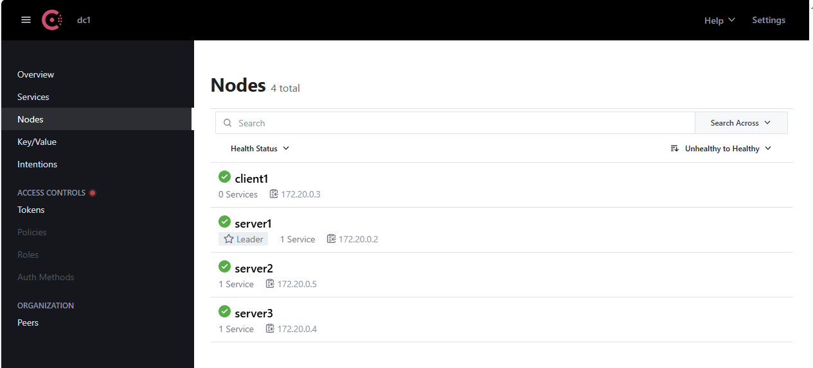
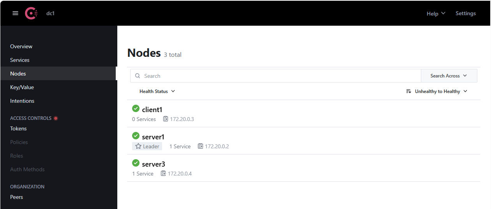

# ДЗ 8. DCS

## Домашнее задание

DCS
Цель:
В результате выполнения ДЗ вы развернете отказоустойчивый DCS.

Описание/Пошаговая инструкция выполнения домашнего задания:
- Разворачиваем кластер Etcd любым способом. Проверяем отказоустойчивость
- Разворачиваем кластер Consul любым способом. Проверяем отказоустойчивость

Критерии оценки:
10 баллов за 1 из кластеров  
20 баллов за 2 кластера

---

## **1. Развёртывание отказоустойчивого кластера Etcd**

### **Шаг 1: Создаём `docker-compose.yml` для Etcd**

Создадим кластер из **3 нод** (можно масштабировать до 5 для большей надёжности).

```yaml
services:
  etcd1:
    image: docker.io/bitnami/etcd:latest
    container_name: etcd1
    hostname: etcd1
    restart: always
    environment:
      - ALLOW_NONE_AUTHENTICATION=yes
      - ETCD_NAME=etcd1
      - ETCD_INITIAL_ADVERTISE_PEER_URLS=http://etcd1:2380
      - ETCD_LISTEN_PEER_URLS=http://0.0.0.0:2380
      - ETCD_LISTEN_CLIENT_URLS=http://0.0.0.0:2379
      - ETCD_ADVERTISE_CLIENT_URLS=http://etcd1:2379
      - ETCD_INITIAL_CLUSTER_TOKEN=etcd-cluster
      - ETCD_INITIAL_CLUSTER=etcd1=http://etcd1:2380,etcd2=http://etcd2:2380,etcd3=http://etcd3:2380
      - ETCD_INITIAL_CLUSTER_STATE=new
    ports:
      - 2381:2379
    volumes:
      - ./data/etcd1:/etcd_data

  etcd2:
    image: docker.io/bitnami/etcd:latest
    container_name: etcd2
    hostname: etcd2
    restart: always
    environment:
      - ALLOW_NONE_AUTHENTICATION=yes
      - ETCD_NAME=etcd2
      - ETCD_INITIAL_ADVERTISE_PEER_URLS=http://etcd2:2380
      - ETCD_LISTEN_PEER_URLS=http://0.0.0.0:2380
      - ETCD_LISTEN_CLIENT_URLS=http://0.0.0.0:2379
      - ETCD_ADVERTISE_CLIENT_URLS=http://etcd2:2379
      - ETCD_INITIAL_CLUSTER_TOKEN=etcd-cluster
      - ETCD_INITIAL_CLUSTER=etcd1=http://etcd1:2380,etcd2=http://etcd2:2380,etcd3=http://etcd3:2380
      - ETCD_INITIAL_CLUSTER_STATE=new
    ports:
      - 2382:2379
    volumes:
      - ./data/etcd2:/etcd_data

  etcd3:
    image: docker.io/bitnami/etcd:latest
    container_name: etcd3
    hostname: etcd3
    restart: always
    environment:
      - ALLOW_NONE_AUTHENTICATION=yes
      - ETCD_NAME=etcd3
      - ETCD_INITIAL_ADVERTISE_PEER_URLS=http://etcd3:2380
      - ETCD_LISTEN_PEER_URLS=http://0.0.0.0:2380
      - ETCD_LISTEN_CLIENT_URLS=http://0.0.0.0:2379
      - ETCD_ADVERTISE_CLIENT_URLS=http://etcd3:2379
      - ETCD_INITIAL_CLUSTER_TOKEN=etcd-cluster
      - ETCD_INITIAL_CLUSTER=etcd1=http://etcd1:2380,etcd2=http://etcd2:2380,etcd3=http://etcd3:2380
      - ETCD_INITIAL_CLUSTER_STATE=new
    ports:
      - 2383:2379
    volumes:
      - ./data/etcd3:/etcd_data
```
### **Шаг 2: Запуск кластера**
```bash
docker-compose up -d

[+] Running 4/4
 ✔ etcd2 Pulled                                                                                                                                 8.8s
 ✔ etcd3 Pulled                                                                                                                                 8.8s
   ✔ db415c35ca46 Pull complete                                                                                                                 5.9s
 ✔ etcd1 Pulled                                                                                                                                 8.8s
[+] Running 4/4
 ✔ Network etcd_default  Created                                                                                                                0.1s
 ✔ Container etcd1       Started                                                                                                                0.6s
 ✔ Container etcd3       Started                                                                                                                0.6s
 ✔ Container etcd2       Started                                                                                                                0.6s

```

### **Шаг 3: Проверка работоспособности**

1. **Проверим список членов кластера:**
```bash
docker exec -it etcd1 etcdctl member list -w table

+------------------+---------+-------+-------------------+-------------------+------------+
|        ID        | STATUS  | NAME  |    PEER ADDRS     |   CLIENT ADDRS    | IS LEARNER |
+------------------+---------+-------+-------------------+-------------------+------------+
| ade526d28b1f92f7 | started | etcd1 | http://etcd1:2380 | http://etcd1:2379 |      false |
| bd388e7810915853 | started | etcd3 | http://etcd3:2380 | http://etcd3:2379 |      false |
| d282ac2ce600c1ce | started | etcd2 | http://etcd2:2380 | http://etcd2:2379 |      false |
+------------------+---------+-------+-------------------+-------------------+------------+


```

2. **Тестирование записи и чтения данных**
	Записываем ключ:
```bash
docker exec -it etcd1 etcdctl put my_key "Hello, Etcd!"
OK
```
3. **Читаем ключ с другой ноды:**
```bash
docker exec -it etcd2 etcdctl get my_key
my_key
Hello, Etcd!
```

**Данные успешно прочитаны**

### **Шаг 4. Проверка отказоустойчивости**

#### **1.4.1. Останавливаем одну ноду**
```bash
docker stop etcd2
```
#### **1.4.2. Проверяем, что кластер продолжает работать**
1. **Чтение данных:**
```bash
docker exec -it etcd1 etcdctl get my_key
my_key
Hello, Etcd!
```
**Данные успешно получены**

1. **Проверка статуса кластера:**
```bash
docker exec -it etcd1 etcdctl endpoint status --cluster
```

 **Видим, что `etcd2` недоступен, но остальные ноды работают.**
```bash
Failed to get the status of endpoint http://etcd2:2379 (context deadline exceeded)
http://etcd1:2379, ade526d28b1f92f7, 3.6.0, 3.6.0, 20 kB, 16 kB, 20%, 0 B, true, false, 3, 12, 12, , , false
http://etcd3:2379, bd388e7810915853, 3.6.0, 3.6.0, 20 kB, 16 kB, 20%, 0 B, false, false, 3, 12, 12, , , false

```
    
2. **Попытка записи:**
```bash
docker exec -it etcd1 etcdctl put new_key "Cluster is still alive!"
OK
```
**Операция записи завершилась успешно**

#### **1.4.3. Возвращаем ноду обратно**

```bash
docker start etcd2
```

**Проверяем, что нода вернулась в кластер:**

```bash
docker exec -it etcd1 etcdctl endpoint status --cluster
http://etcd1:2379, ade526d28b1f92f7, 3.6.0, 3.6.0, 20 kB, 16 kB, 20%, 0 B, true, false, 3, 15, 15, , , false
http://etcd3:2379, bd388e7810915853, 3.6.0, 3.6.0, 20 kB, 16 kB, 20%, 0 B, false, false, 3, 15, 15, , , false
http://etcd2:2379, d282ac2ce600c1ce, 3.6.0, 3.6.0, 25 kB, 16 kB, 34%, 0 B, false, false, 3, 15, 15, , , false

```
### **1.5. Вывод**
- Кластер **Etcd** успешно развёрнут и он **отказоустойчив**.  
- При падении одной ноды данные остаются доступными.  
- После восстановления нода автоматически возвращается в кластер.

## **2. Развёртывание отказоустойчивого кластера Consul**

### 2.1: Создаём `docker-compose.yml` для Consul

Развернём кластер из **3 серверов** (рекомендуется для кворума) и 1 ноды клиента.
```yaml
services:
  consul-server1:
    image: hashicorp/consul:1.14.3
    container_name: consul-server1
    command: "agent -server -bootstrap-expect=3 -node=server1 -client=0.0.0.0 -bind=0.0.0.0 -ui -data-dir=/consul/data -config-dir=/consul/config"
    environment:
      - CONSUL_LOCAL_CONFIG={"datacenter":"dc1"}
    volumes:
      - consul-server1:/consul/data
    ports:
      - "8500:8500"
      - "8600:8600/udp"
    networks:
      - consul-net

  consul-server2:
    image: hashicorp/consul:1.14.3
    container_name: consul-server2
    command: "agent -server -bootstrap-expect=3 -node=server2 -client=0.0.0.0 -bind=0.0.0.0 -ui -data-dir=/consul/data -config-dir=/consul/config -join=consul-server1"
    environment:
      - CONSUL_LOCAL_CONFIG={"datacenter":"dc1"}
    volumes:
      - consul-server2:/consul/data
    networks:
      - consul-net
    depends_on:
      - consul-server1

  consul-server3:
    image: hashicorp/consul:1.14.3
    container_name: consul-server3
    command: "agent -server -bootstrap-expect=3 -node=server3 -client=0.0.0.0 -bind=0.0.0.0 -ui -data-dir=/consul/data -config-dir=/consul/config -join=consul-server1"
    environment:
      - CONSUL_LOCAL_CONFIG={"datacenter":"dc1"}
    volumes:
      - consul-server3:/consul/data
    networks:
      - consul-net
    depends_on:
      - consul-server1

  consul-client1:
    image: hashicorp/consul:1.14.3
    container_name: consul-client1
    command: "agent -node=client1 -client=0.0.0.0 -bind=0.0.0.0 -data-dir=/consul/data -config-dir=/consul/config -join=consul-server1"
    environment:
      - CONSUL_LOCAL_CONFIG={"datacenter":"dc1"}
    volumes:
      - consul-client1:/consul/data
    networks:
      - consul-net
    depends_on:
      - consul-server1

volumes:
  consul-server1:
  consul-server2:
  consul-server3:
  consul-client1:

networks:
  consul-net:
    driver: bridge
```
### Разбор ключевых параметров:

| Параметр                   | Описание                                                            |
| -------------------------- | ------------------------------------------------------------------- |
| `-server`                  | Запуск в режиме сервера (хранит данные, участвует в выборах лидера) |
| `-bootstrap-expect=3`      | Ожидаемое количество серверных нод перед началом работы кластера    |
| `-ui`                      | Включение веб-интерфейса                                            |
| `-node=consul-server1`     | Уникальное имя ноды                                                 |
| `-client=0.0.0.0`          | Разрешение подключений с любых IP                                   |
| `-join=consul-server1`     | Присоединение к существующему кластеру через первую ноду            |
| `-data-dir`, `-config-dir` | Пути к данным и конфигурации                                        |
### 2.2. Запуск кластера

```bash
docker-compose up -d

[+] Running 9/9
 ✔ Network consul_consul-net       Created                                                                                                      0.0s
 ✔ Volume "consul_consul-server2"  Created                                                                                                      0.0s
 ✔ Volume "consul_consul-server3"  Created                                                                                                      0.0s
 ✔ Volume "consul_consul-client1"  Created                                                                                                      0.0s
 ✔ Volume "consul_consul-server1"  Created                                                                                                      0.0s
 ✔ Container consul-server1        Started                                                                                                      0.6s
 ✔ Container consul-client1        Started                                                                                                      0.6s
 ✔ Container consul-server3        Started                                                                                                      0.6s
 ✔ Container consul-server2        Started                                                                                                      0.6s

```
### 2.3 Проверка работоспособности

**Откроем Consul UI в браузере: [http://localhost:8500](http://localhost:8500/)**


**Проверим список нод в консоле:**
```bash
docker exec -it consul-server1 consul members
Node     Address          Status  Type    Build   Protocol  DC   Partition  Segment
server1  172.20.0.2:8301  alive   server  1.14.3  2         dc1  default    <all>
server2  172.20.0.5:8301  alive   server  1.14.3  2         dc1  default    <all>
server3  172.20.0.4:8301  alive   server  1.14.3  2         dc1  default    <all>
client1  172.20.0.3:8301  alive   client  1.14.3  2         dc1  default    <default>
```
**Видим 3 сервера и 1 клиент.**

### 2.4 Тестирование отказоустойчивости
#### Тест 1: Остановка одного сервера

**Остановите один из серверов:**
```bash
docker stop consul-server2
```

**Проверяем статус кластера:**
```bash
docker exec -it consul-server1 consul operator raft list-peers
Node     ID                                    Address          State     Voter  RaftProtocol
server3  0e71cb86-2c5b-287a-aa0d-d3cf0debbb35  172.20.0.4:8300  follower  true   3
server1  71ab4bd9-4b2a-a0db-cc4f-3acefead6036  172.20.0.2:8300  leader    true   3
```
**Осталось 2 сервера `server1` и `server3`.**
**В UI тоже видим 2 сервера:**


#### Тест 2: Остановка двух серверов (кворум потерян)

**Остановим еще один сервер:**
```bash
docker stop consul-server3
```
**Проверяем статус:**
```bash
docker exec -it consul-server1 consul operator raft list-peers
Error getting peers: Failed to retrieve raft configuration: Unexpected response code: 500 (No cluster leader)
```
**Ожидаемо получаем ошибку, кластер неработоспособен т.к. остался один сервер, кворум не получился и лидер не был выбран**

**Пробуем зарегистрировать новый сервис через API:**
```bash
curl -X PUT -d '{"name": "test-service"}' http://localhost:8500/v1/agent/service/register
```
**Ошибка, так как кворум потерян.**
#### Тест 3: Восстановление кластера

**Запускаем остановленные серверы:**
```bash
docker start consul-server2 consul-server3
```

**Проверяем восстановление:**
```bash
docker exec -it consul-server1 consul operator raft list-peers
Node     ID                                    Address          State     Voter  RaftProtocol
server3  0e71cb86-2c5b-287a-aa0d-d3cf0debbb35  172.20.0.5:8300  follower  true   3
server1  71ab4bd9-4b2a-a0db-cc4f-3acefead6036  172.20.0.2:8300  leader    true   3
server2  0c6b1667-6d12-c076-0b1d-83394619f03b  172.20.0.4:8300  follower  true   3
```
### 2.5 Выводы

- Consul остается работоспособным при отказе одного сервера из трех (кворум сохраняется).
- При отказе двух серверов кластер перестает обрабатывать запросы на запись (AP-система в терминах CAP).
- После восстановления серверов кластер автоматически возвращается в рабочее состояние.
